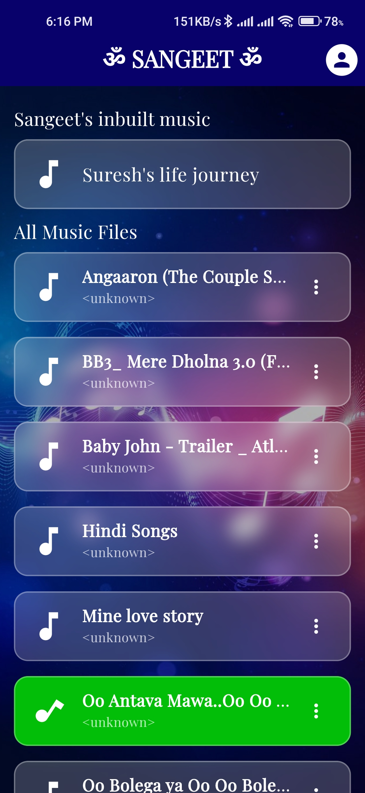
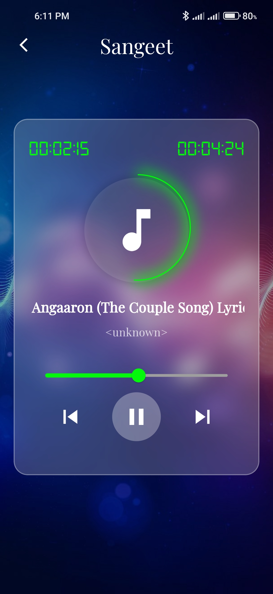

# 🎵Sangeet

Sangeet is a modern and elegant Flutter-based music app that allows users to explore and enjoy their favorite music files stored locally on their devices. With its sleek user interface and robust audio playback features, Sangeet enhances your music-listening experience.

---

## 🌟 Features

- **Music Playback**: Play your favorite music tracks with intuitive controls.
- **Dynamic UI**: Rotating icons for currently playing tracks.
- **Local Storage Access**: Fetch and list all music files from device storage.
- **Developer Info**: Dedicated section to view developer contact details.
- **Glassmorphism Design**: Aesthetic glass effect for the UI elements.

---

## 📱 Screenshots

### Preview

<div style="display:inline-block;">



<video src="./assets/videos/video.mp4" height="500px" width="300px">
</div>

---

## 🚀 Installation

1. Clone the repository:

   ```bash
   git clone https://github.com/0sureshyadav0/sangeet_0.0.1.git
   ```

2. Navigate to the project directory:

   ```bash
   cd sangeet_0.0.1
   ```

3. Install dependencies:

   ```bash
   flutter pub get
   ```

4. Run the app:
   ```bash
   flutter run
   ```

---

## 🛠️ Technologies Used

- **Flutter**: The app framework.
- **Dart**: Programming language.
- **Audioplayers Package**: For audio playback.
- **Provider Package**: For state management.
- **Get Package**: For navigation and snackbars.
- **Permission Handler**: For handling storage permissions.

---

## 📂 Project Structure

```plaintext
sangeet_0.0.1/
├── lib/
│   ├── screens/
│   │   ├── music_list_screen.dart
│   │   ├── music_player.dart
│   │   └── developer.dart
│   ├── providers/
│   │   └── music_provider.dart
│   ├── consts/
│   │   └── consts.dart
│   └── main.dart
├── assets/
│   ├── images/
│   │   └── background.jpeg
│   ├── music/
│       └── सुरेशको जीवनको कथा.mp3
└── pubspec.yaml
```

---

## 📄 License

This project is licensed under the MIT License. See the `LICENSE` file for details.

---

## 🧑‍💻 Developer

- **Suresh Yadav**
- 🌐 [sureshyadav.info.np](http://sureshyadav.info.np)

---

## 🙌 Contribution

Contributions are welcome! Feel free to open an issue or submit a pull request.

---

## 📞 Support

For any issues or feedback, contact [Suresh Yadav](mailto:sureshyadav.info.np@gmail.com).

---

Enjoy your music with **Sangeet**! 🎶
